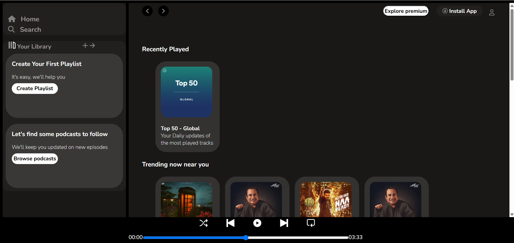

# 🎧 Spotify Web Player Clone

A **responsive frontend clone** of the Spotify Web Player built using **HTML5** and **CSS3**.  
This project replicates Spotify's layout including sidebar navigation, trending cards, featured charts, and a static footer music player.

---

## 📸 Preview

  
Or watch the short demo video [here](demo/demo.mp4)

---

## 🛠 Features

- 🎨 Clean UI inspired by Spotify’s official web player
- 📱 Fully responsive design (desktop & mobile)
- 🧭 Sidebar navigation with Home, Search & Library
- 🧾 Multiple content sections (Trending, Charts, etc.)
- 🎵 Static footer music player controls
- 🎯 Interactive hover and click effects

---

## 🎨 CSS Components & Features Used

This project makes strong use of **modern CSS techniques**:

### 🔷 Layout & Structure
- `flexbox` for flexible layout management
- `position: absolute/relative/fixed` for precise control
- `media queries` for responsive design on different screen sizes

### 🎨 Styling
- Custom scroll and range bar styling
- Soft rounded `border-radius` for cards and buttons
- `box-shadow` on hover to enhance depth
- Reusable utility classes (`.btn`, `.card`, `.arrow`, etc.)

### 🔁 Transitions & Effects
- `:hover` and `:active` effects on buttons and icons
- `transform: scale()` for interaction feedback
- Smooth `transition` effects for sidebar on mobile

### 💡 Fonts & Icons
- **Google Fonts**: `Poppins` and `Nunito` for elegant typography
- **Font Awesome** for all iconography (hamburger, arrows, plus, etc.)

### 📱 Responsiveness
- Custom sidebar toggling for mobile using:
  - `checkbox` input trick (`#check-for-mobile`)
  - `~ sibling selector` for sidebar animation
- Adaptive card layout using `flex-wrap` and `overflow-x: auto`
- Separate designs for small screens (<900px and <527px)

---

## 🧰 Tech Stack

- **HTML5** for structure
- **CSS3** for styling
- **Flexbox & Media Queries** for responsiveness
- **Font Awesome** for icons
- **Google Fonts** for typography

---

## 📁 Project Structure

